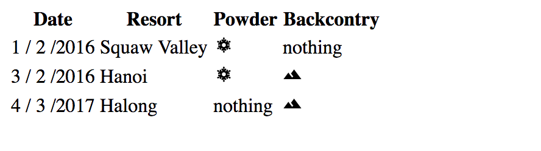

# Working with array using .map

Let say we have an array

```react
const numbers = [1,2,3,4,5]
```

We can use function 

```react
array.map((item) =>
          {item}
);
```

## Example

```react
const display = numbers.map((item) =>
 	<li>{item}</li>
);
                            
ReactDOM.render(
	display,
    document.getElementById('root')
)

```

# Display child component using arrays

in `index.js` we can set `components as an array`.

```react
render(
	<SkiDayList days={
		[
			{
				resort: "Squaw Valley",
				date: new Date("1/2/2016"),
				powder: true,
				backcountry: false
			},
			{
				resort: "Hanoi",
				date: new Date("3/2/2016"),
				powder: true,
				backcountry: true
			},
			{
				resort: "Halong",
				date: new Date("4/3/2017"),
				powder: false,
				backcountry: true
			}
		]
	}/>
	,
	document.getElementById('react-container')
)
```

of course we have to 

```react
import { SkiDayList } from './components/SkiDayList'
```

ok so component `day` in here is an array.

Next, let's create our `SkiDayList.js`

```react
import { SkiDayRow } from './SkiDayRow'
```

we will us this later.

```react
export const SkiDayList = ({days}) => (
)
```

 `{}` because components `days` is actually an array

Now let do some quick html

```react
export const SkiDayList = ({days}) => (
    <table>
        <thead>
            <tr>
                <th>Date</th>
                <th>Resort</th>
                <th>Powder</th>
                <th>Backcontry</th>

            </tr>
        </thead>
        <tbody>
            ...
        </tbody>
    </table>
)
```

now we want to add in `<tbody>` our array data from `index.js`

```react
<tbody>
	{days.map((item) => 
             <SkiDayRow resort = {item.resort}
                 		date = {item.date}
                 		powder= {item.powder}
                 		backcountry = {item.backcountry}/>
             )};
</tbody>
```

We call each child in `days` is `item`. To access to a child property, we use `child.property`.

So there will be multiple `SkiDayRow` according to the number of `item in days`.


So now lets create our `SkiDayRow.js`

```react
import { MdTerrain } from 'react-icons/md'
import { TiWeatherSnow } from 'react-icons/ti'
import { FaCalendar } from 'react-icons/fa'
```

Some icons.


```react
export const SkiDayRow = ({resort,date,powder,backcountry}) => (
	<tr>
    	<td>
        	{date.getMonth() + 1} / {date.getDate()} / {date.getFullYear()}
        </td>
        <td>
        	{resort}
        </td>
        <td>
            {(powder) ? <TiWeatherSnow/> : "nothing"}
        </td>
        <td>
            {(backcountry) ? <MdTerrain/> : "nothing"}
        </td>
    </tr>
)
```

Since our `date` property declared by class `Date`. We can use it `subFunction`. `getMonth()` will return array type (start from 0) so we will need + 1 to get relevant month.

**Result**



## Extra

In `SkiDayList.js`

If you want to keep track of index, you can add `{days.map((item,i)=>)}` i will keep track of the index

```react
<tbody>
	{days.map((item,i) => 
             <SkiDayRow key = {i}
                 		resort = {item.resort}
                 		date = {item.date}
                 		powder= {item.powder}
                 		backcountry = {item.backcountry}/>
             )};
</tbody>
```


##### Short hand

To loop through all the attribute in item. you can do

```react
<tbody>
    {days.map((item,i) =>
              <SkiDayRow  key={i}
                  {...item}/>
             )}
</tbody>
```

